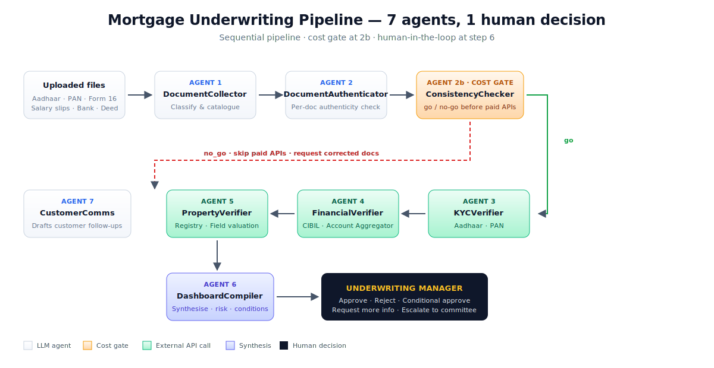

# Mortgage Underwriting Agent · India retail home loans

> **A 7-agent pipeline that processes a home-loan application end to end and hands the
> human underwriter a decision-ready dashboard. No agent ever approves or rejects
> autonomously — every credit call stays with the manager.**


<p align="center">
  
</p>

> **Dashboard preview** — capture instructions in [`docs/SCREENSHOT.md`](docs/SCREENSHOT.md).
> Once captured, the image lives at `docs/dashboard.png` and renders here:
>
> <p align="center"></p>

---

## Why this exists

Indian retail mortgage underwriting is a paper-heavy, multi-system workflow: an
underwriter has to chase KYC matches across Aadhaar and PAN, sanity-check
income against bank statements and Form 16, validate property title with the
sub-registrar, and reconcile everything against RBI policy on FOIR and LTV.
Most of that is patterning, not judgement. This project pushes the patterning
to a sequence of focused LLM agents and reserves the judgement for a human at
a clean dashboard.

Two design choices worth flagging up front:

A **cost gate at step 2b.** Before any paid third-party API is hit
(Aadhaar / PAN / CIBIL / land registry), a consistency-check agent decides
go/no-go on the document set. Applications with fundamental inconsistencies
are routed back to the customer for corrections instead of burning API spend.

A **human-in-the-loop terminus.** Step 6 compiles a structured dashboard —
risk level, key positives, key concerns, conditions for approval, data gaps —
but the recommendation is explicitly preliminary. The manager owns the
decision; the agents own the prep.

## Agent map

| # | Agent | Job |
|---|-------|-----|
| 1 | DocumentCollector | Classify and catalogue uploaded files |
| 2 | DocumentAuthenticator | Per-document authenticity check |
| 2b | ConsistencyChecker | Cross-document checks · go/no-go cost gate |
| 3 | KYCVerifier | Aadhaar + PAN verification |
| 4 | FinancialVerifier | CIBIL score, FOIR, Account Aggregator |
| 5 | PropertyVerifier | Title, encumbrance, LTV vs RBI cap |
| 6 | DashboardCompiler | Synthesise into underwriter dashboard |
| 7 | CustomerComms | Draft customer follow-ups |

## Run it

Prerequisites: Python 3.11+, an Anthropic API key.

```bash
git clone https://github.com/Dev251288/underwriting-agent.git
cd underwriting-agent
pip install -e ".[dev]"

cp .env.example .env                # set ANTHROPIC_API_KEY in .env

python main.py seed                 # populate work queue with 5 demo apps
python main.py serve                # dashboard at http://127.0.0.1:8000
python main.py demo                 # full pipeline on the built-in sample
pytest                              # all tests run without an API key
```

## Implementation notes

Every agent calls Claude with `tool_choice={"type": "tool", "name": "..."}`,
forcing a single structured tool call whose `input_schema` is the agent's
output contract. System prompts are marked `cache_control: {"type": "ephemeral"}`
so they are served from cache across repeated runs within the TTL.

| Layer | Choice |
|-------|--------|
| Agents | Anthropic Claude via `anthropic` Python SDK |
| API server | FastAPI + Uvicorn |
| Dashboard | Single-page HTML + Tailwind (CDN) + vanilla JS |
| Data models | Pydantic v2 |
| Storage | Per-application JSON in `outputs/` |

## External APIs

Production integrations live in `src/mocks/` as deterministic stand-ins for:
UIDAI Aadhaar, NSDL PAN, TransUnion CIBIL, RBI Account Aggregator, State
Land Registry. Swap each mock for a real HTTP client to go live — the agent
contracts above don't need to change.

## Indian regulatory context baked in

KYC follows RBI KYC Master Directions and the PAN–Aadhaar linking mandate.
Credit eligibility uses a CIBIL floor of 650 (with 600–649 routed to Credit
Committee, below 600 a hard reject) and a FOIR ceiling of 50% per RBI guidance.
LTV ceilings follow the RBI circular: 90% on loans up to ₹30L, 80% on ₹30–75L,
75% above ₹75L; breaches within 5pp of the cap escalate to Credit Committee,
beyond 5pp hard-reject. Property records are matched against sub-registrar
and RERA registrations.

## Repo layout

```
underwriting-agent/
├── main.py                       # CLI: demo | serve | seed
├── src/
│   ├── orchestrator.py           # 7-step pipeline coordinator
│   ├── agents/                   # one file per agent
│   ├── mocks/                    # mock external APIs
│   ├── models/                   # Pydantic data models
│   └── api/                      # FastAPI dashboard
├── tests/                        # pytest, no API key needed
├── docs/
│   ├── architecture.svg          # README hero
│   └── SCREENSHOT.md             # how to capture dashboard.png
└── outputs/                      # one JSON per processed application
```

## Roadmap

Tracked in `summary.md`. Next four items: request-more-info workflow with a
fixed customer SLA, work-queue landing page, exception-only Credit Committee
escalation, and a dashboard redesign that collapses duplicate information into
an expandable scorecard.

## Suggested GitHub topics

After pushing, set these in **Settings → General → Topics** to make the repo
discoverable:

```
agentic-ai  claude  anthropic  multi-agent  human-in-the-loop
fintech  mortgage  underwriting  india  rbi  python  fastapi  pydantic
```

## License

MIT. See [`LICENSE`](LICENSE).
